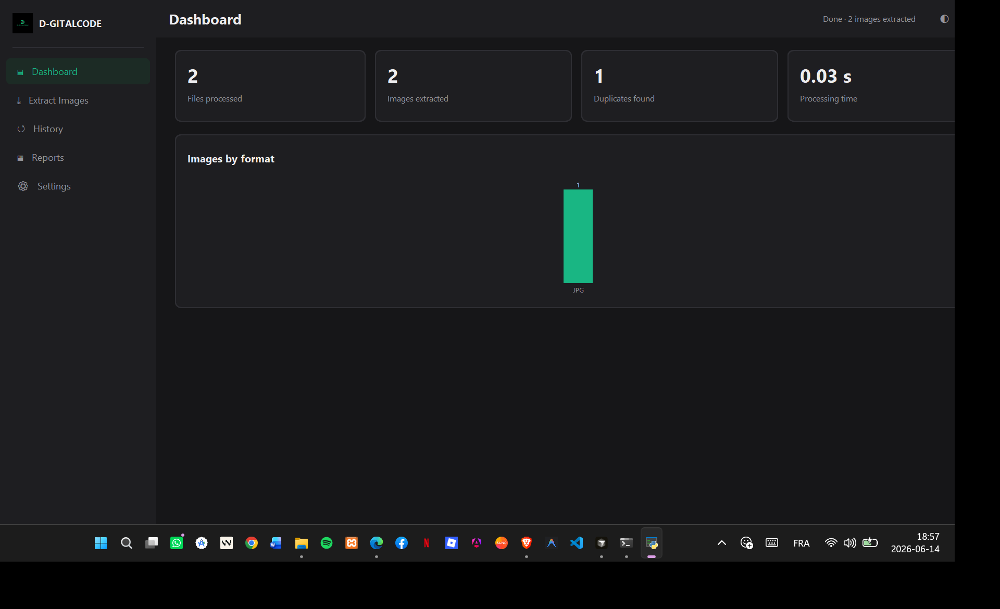
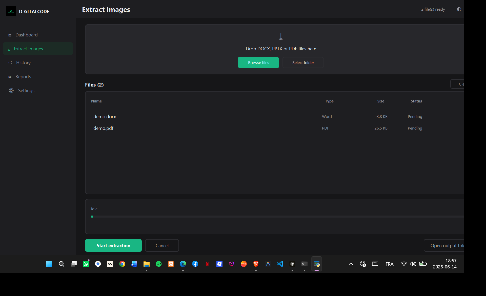
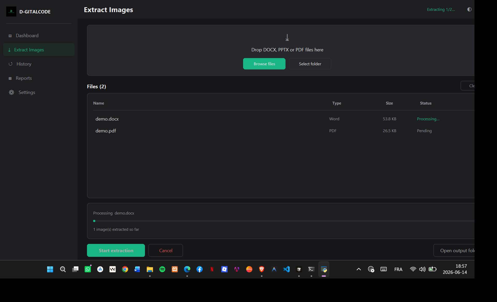
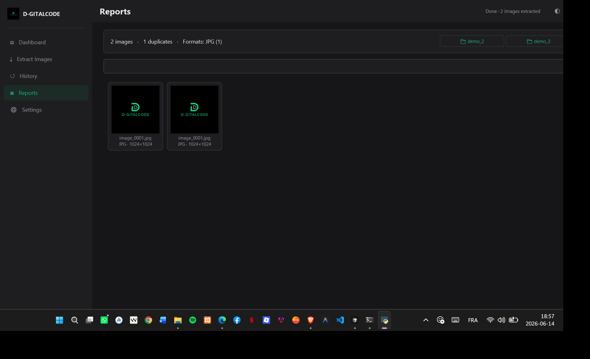
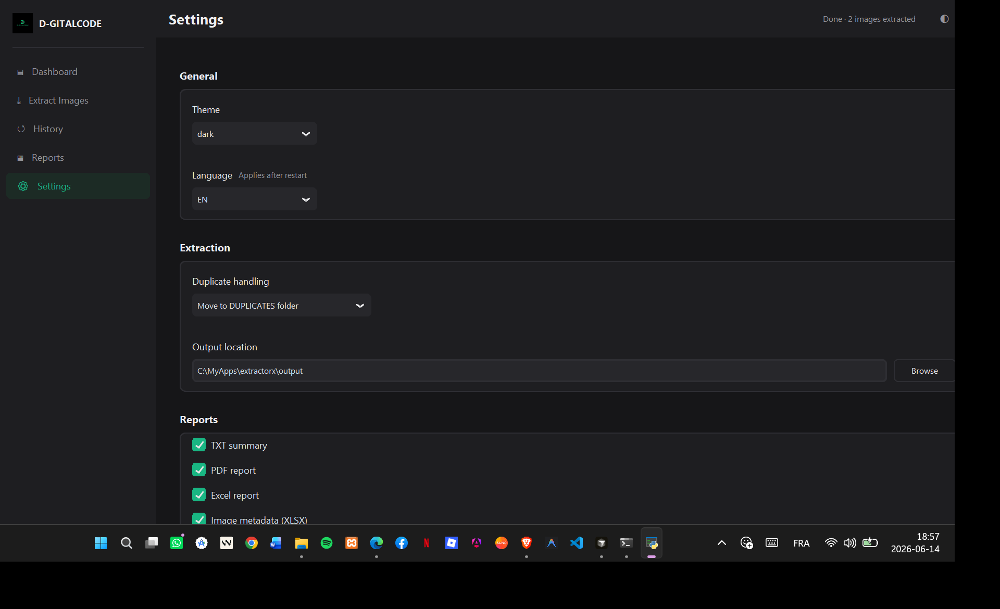
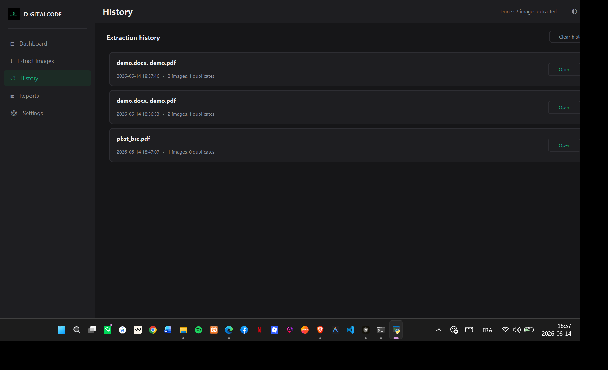
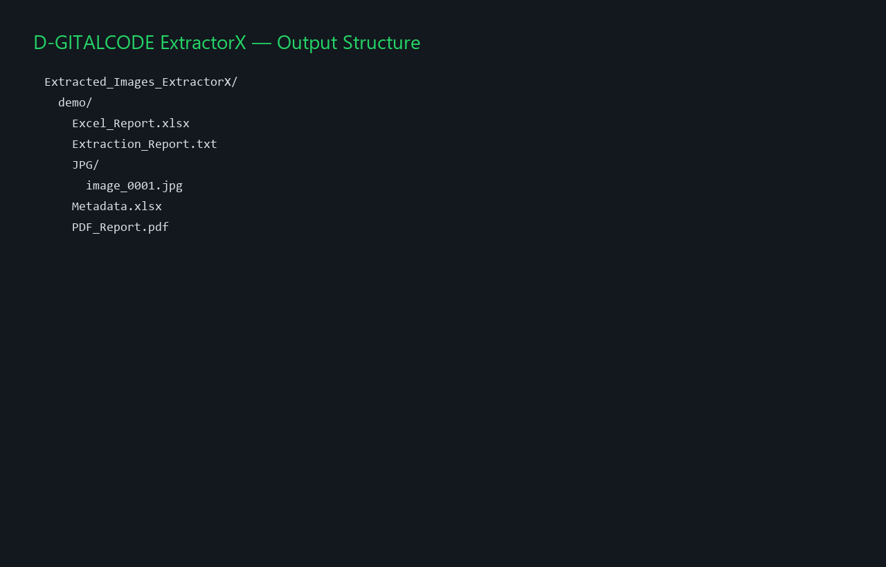

<div align="center">


# D-GITALCODE ExtractorX

**Extract, organize, and report every image embedded in Word, PowerPoint, and PDF documents — at production scale.**

[](CHANGELOG.md)
[](https://www.python.org/)
[](LICENSE)
[]()
[](https://github.com/TomSchimansky/CustomTkinter)

[Features](#features) · [Screenshots](#screenshots) · [Installation](#installation) · [Usage](#usage) · [Architecture](#architecture) · [Docs](#documentation)

</div>

---

## Overview

**D-GITALCODE ExtractorX** is a professional desktop product for teams that need reliable document media extraction — legal, education, publishing, marketing, and enterprise document workflows.

Drop in DOCX, DOC, PPTX, PPT, or PDF files. ExtractorX automatically selects the correct engine, extracts every embedded image, deduplicates across batches, organizes output by format, and generates branded reports — all without cloud uploads or external dependencies.

### Why ExtractorX exists

| Problem | ExtractorX solution |
|---------|---------------------|
| Manual copy-paste from Office documents | Automated extraction from DOCX/DOC/PPTX/PPT/PDF |
| Unorganized image dumps | Per-document folders with format-based structure |
| Duplicate assets across files | SHA-256 deduplication with configurable handling |
| No audit trail for clients | TXT, PDF, Excel, and metadata reports per document |
| Slow batch workflows | Threaded batch queue with live progress and history |

### Target users

- **Agencies & studios** archiving client document assets
- **Publishers & educators** extracting figures from course packs
- **Legal & compliance teams** processing document evidence
- **IT departments** standardizing internal media extraction

---

## Features

- **Multi-format extraction** — DOCX, DOC, PPTX, PPT, PDF with automatic engine selection
- **Drag & drop** — drop files or folders directly onto the application window
- **Batch processing** — queue many documents; background worker keeps the UI responsive
- **Smart deduplication** — SHA-256 hashing; move duplicates, skip, or keep inline
- **Per-document output** — self-contained folder per source file with format subfolders
- **Image gallery** — searchable thumbnail grid with format and dimension metadata
- **Statistics dashboard** — files processed, images extracted, duplicates, timing, format chart
- **Professional reports** — branded TXT, PDF, Excel, and metadata exports per document
- **Extraction history** — reopen any previous run and its output folder in one click
- **Settings persistence** — theme, language, output path, duplicate mode, report formats
- **Multilingual UI** — English, Français, العربية
- **Dark / light themes** — professional D-GITALCODE design system
- **Standalone EXE** — one-click Windows build via `build_exe.bat` (PyInstaller)

### Supported formats

| Type | Extension | Method |
|------|-----------|--------|
| Word (modern) | `.docx` | OOXML ZIP media parsing |
| Word (legacy) | `.doc` | Binary signature carving |
| PowerPoint (modern) | `.pptx` | OOXML ZIP media parsing |
| PowerPoint (legacy) | `.ppt` | Binary signature carving |
| PDF | `.pdf` | PyMuPDF image object extraction |

**Output image formats:** PNG · JPG · GIF · BMP · TIFF · WEBP

---

## Screenshots

| Dashboard | Extraction workflow |
| :-------: | :------------------: |
|  |  |

| Batch progress | Results & gallery |
| :------------: | :----------------: |
|  |  |

| Settings | History |
| :------: | :-----: |
|  |  |

| Output structure |
| :--------------: |
|  |

> Captured from the rebranded **D-GITALCODE ExtractorX v2.0.0** desktop application. Regenerate with `python scripts/capture_portfolio_screenshots.py`.

---

## Architecture

ExtractorX uses a strict layered desktop architecture:

```text
GUI (CustomTkinter)  →  Services  →  Core  →  Utils
     pages.py            batch         extractor    hash_utils
     components.py       report        file_handler path_utils
     theme.py            settings      image_utils  format_utils
                         history
                         logging
```

| Layer | Role |
|-------|------|
| **GUI** | Presentation, navigation, drag-and-drop, progress display |
| **Services** | Batch orchestration, reports, settings, history, logging |
| **Core** | Pure extraction logic — no UI dependencies |
| **Utils** | Hashing, path safety, formatting helpers |

Full details: [docs/ARCHITECTURE.md](docs/ARCHITECTURE.md)

---

## Tech stack

| Layer | Technology |
|-------|------------|
| Language | Python 3.11+ |
| GUI | CustomTkinter + tkinterdnd2 |
| Image processing | Pillow |
| PDF extraction | PyMuPDF (`fitz`) |
| Office parsing | `zipfile` (OOXML) + binary carving (legacy) |
| Reports | ReportLab (PDF), openpyxl (Excel) |
| Packaging | PyInstaller |
| i18n | JSON language files (`resources/languages/`) |

---

## Installation

> **Quick start:** See [docs/SETUP.md](docs/SETUP.md) for the full step-by-step guide.

### Prerequisites

- Python **3.11+**
- pip
- Windows, macOS, or Linux

### Steps

```bash
# 1. Clone
git clone https://github.com/dgitalcode/extractorx.git
cd extractorx

# 2. Virtual environment
python -m venv venv
venv\Scripts\activate        # Windows
# source venv/bin/activate  # macOS / Linux

# 3. Dependencies
pip install -r requirements.txt

# 4. Launch
python main.py
```

### Windows executable

```bat
build_exe.bat
```

Output: `dist\ExtractorX.exe`

---

## Environment variables

ExtractorX is primarily configured via **Settings** in the GUI (`settings.json`). Optional environment overrides:

| Variable | Required | Description |
|----------|----------|-------------|
| `EXTRACTORX_OUTPUT_DIR` | No | Default output parent directory |
| `EXTRACTORX_LOG_LEVEL` | No | Log verbosity: `DEBUG`, `INFO`, `WARNING`, `ERROR` |

Copy `.env.example` to `.env` for local overrides. **Never commit `.env`.**

Persistent user settings (theme, language, duplicate mode, report formats) are stored in `settings.json` next to the application.

---

## Usage

### Basic workflow

1. Open **Extract Images** and drop DOCX/PPTX/PDF files (or use **Browse files** / **Select folder**).
2. Review the file queue — name, type, and size are shown before processing.
3. Click **Start extraction** — progress updates per file and per image.
4. Open **Reports** to browse the thumbnail gallery and open output folders.
5. Check **Dashboard** for totals, duplicates, timing, and format distribution.
6. Revisit any run from **History**.

### Example: batch folder extraction

```text
Input:  C:\Projects\ClientDocs\*.docx, *.pdf
Output: C:\Projects\output\Extracted_Images_ExtractorX\
        ├── Annual_Report\
        │   ├── PNG\image_0001.png
        │   ├── JPG\image_0002.jpg
        │   ├── PDF_Report.pdf
        │   └── Metadata.xlsx
        └── Presentation\
            └── PNG\image_0001.png
```

### Duplicate handling modes

| Mode | Behavior |
|------|----------|
| `separate` | Duplicates saved to `DUPLICATES/` subfolder |
| `skip` | Duplicate payloads not written to disk |
| `keep` | Duplicates kept in their format folder |

Configure in **Settings → Extraction → Duplicate handling**.

### Service API

ExtractorX is a desktop application — there is no public HTTP API. Internal service contracts (`BatchService`, `create_extractor`, `ReportService`) are documented in [docs/API.md](docs/API.md).

---

## Project structure

```text
extractorx/
├── main.py                  # Entry point
├── config.py                # Metadata, paths, formats, i18n loader
├── core/                    # Extraction engine (no GUI imports)
│   ├── extractor.py         # Word / PowerPoint / PDF extractors
│   ├── file_handler.py      # Safe file I/O
│   └── image_utils.py       # Format detection (Pillow)
├── services/                # Orchestration layer
│   ├── batch_service.py     # Threaded batch queue
│   ├── report_service.py    # TXT / PDF / XLSX reports
│   ├── settings_service.py  # settings.json persistence
│   ├── history_service.py   # Extraction history
│   └── logging_service.py   # File + console logging
├── gui/                     # CustomTkinter UI
├── utils/                   # Hashing, paths, formatting
├── resources/               # Icons, language files
├── docs/                    # Product documentation
├── logs/                    # Runtime logs (gitignored)
├── output/                  # Default extraction output (gitignored)
├── build_exe.bat            # PyInstaller Windows build
├── requirements.txt
└── .env.example
```

---

## Security considerations

- **100% local processing** — documents never leave the machine; no cloud upload by default
- **No secrets in repository** — `.env` and `settings.json` are gitignored
- **Path sanitization** — output filenames and folders are sanitized before write
- **Integrity checks** — OOXML archives validated before extraction

Full policy: [docs/SECURITY.md](docs/SECURITY.md)

---

## Performance notes

- **Threaded batch worker** — GUI stays responsive during large jobs
- **Lazy folder creation** — format directories created only when images exist
- **Shared duplicate detector** — one SHA-256 registry per batch (cross-file dedup)
- **Streaming ZIP reads** — OOXML media parts read without full unpack to disk
- **PDF xref dedup** — duplicate image references skipped per document

Typical benchmark (13 mixed documents, 88 images): **~2–3 seconds** on modern hardware.

---

## Deployment

### Desktop distribution (current)

| Target | Method |
|--------|--------|
| Windows | `build_exe.bat` → `dist\ExtractorX.exe` |
| macOS / Linux | PyInstaller one-file build (manual, see SETUP.md) |
| Enterprise | Package venv + `requirements.txt` or signed EXE |

### Future web edition

A cloud-hosted ExtractorX API (upload → process → download) could deploy to **Vercel** (API routes) + object storage. The current v2.0 release is **desktop-only** — no Vercel configuration is included. See roadmap below.

---

## Documentation

| Document | Description |
|----------|-------------|
| [docs/SETUP.md](docs/SETUP.md) | Local setup, dependencies, debugging |
| [docs/ARCHITECTURE.md](docs/ARCHITECTURE.md) | System design and data flow |
| [docs/API.md](docs/API.md) | Internal service contracts |
| [docs/SECURITY.md](docs/SECURITY.md) | Security policy and production rules |
| [CHANGELOG.md](CHANGELOG.md) | Version history |
| [CONTRIBUTING.md](CONTRIBUTING.md) | Contribution guidelines |

---

## Roadmap

- [ ] Headless CLI for CI/CD batch pipelines
- [ ] ZIP export of gallery selections
- [ ] Cloud storage targets (Google Drive, OneDrive)
- [ ] OCR layer detection for scanned PDFs
- [ ] ExtractorX Web API (Vercel + object storage)
- [ ] Code signing for Windows/macOS distribution

---

## Contributing

See [CONTRIBUTING.md](CONTRIBUTING.md). Report issues at [github.com/dgitalcode/extractorx/issues](https://github.com/dgitalcode/extractorx/issues).

---

## License

MIT License — see [LICENSE](LICENSE).

---

<div align="center">

**D-GITALCODE ExtractorX**

[dgitalcode.ma](https://dgitalcode.ma) · [dgitalcode@gmail.com](mailto:dgitalcode@gmail.com) · [github.com/dgitalcode/extractorx](https://github.com/dgitalcode/extractorx)

*Professional document media extraction by D-GITALCODE*

</div>
